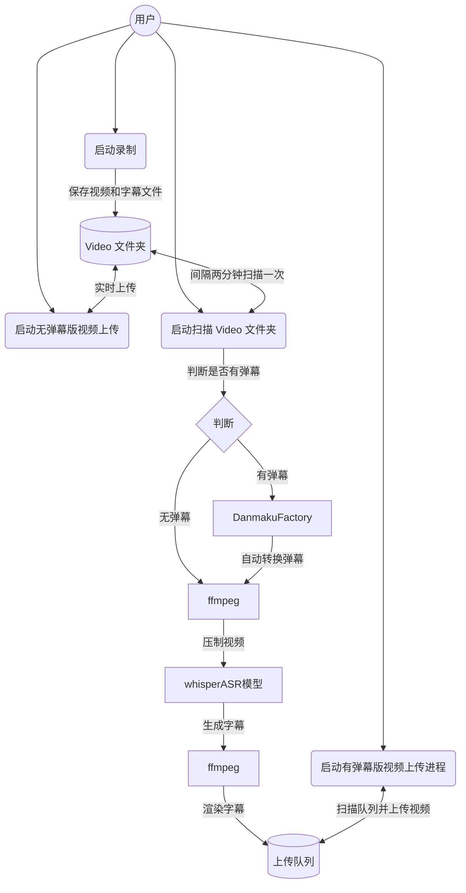

<div align="center">
  <picture>
    <source media="(prefers-color-scheme: dark)" srcset="assets/headerDark.svg" />
    
  </picture>

*7 x 24 小时无人监守录制、渲染弹幕、自动上传，启动项目，人人都是录播员。*

[:page_facing_up: Documentation](#major-features) |
[:gear: Installation](#quick-start) |
[:thinking: Reporting Issues](https://github.com/timerring/bilive/issues/new/choose)

</div>

##  1. Introduction

> 如果您觉得项目不错，欢迎 :star: 也欢迎 PR 合作，如果有任何疑问，欢迎提 issue 交流。

自动监听并录制B站直播和弹幕、自动转换xml弹幕（含付费留言、礼物等）为ass并渲染进视频，自动投稿**弹幕版视频**和**无弹幕视频**至B站，无需GPU，兼容超低配置服务器与主机，**兼容Windows 和 linux操作系统**。


## 2. Major features

- **速度快**：录制的同时可以选择启动无弹幕版视频的上传进程，下播延迟检测后即可直接上线平台。
- **范围广**：多线程同时监听数个直播间，同时录制内容并投稿。
- **空间小**：自动删除已上传的往期直播回放，节省空间，硬盘空间可以重复利用。
- **灵活高**：模版化自定义投稿，支持自定义投稿分区，动态内容，视频描述，视频标题，视频标签等，同时支持多P上传。
- **自动检测合并**：对于网络问题或者连线导致的视频流分段，支持自动检测并合并成为完整视频片段。
- **弹幕版视频**：录制视频同时录制弹幕文件（包含普通弹幕，付费弹幕以及礼物上舰等信息），支持自动转换xml为ass弹幕文件并且渲染到视频中形成**有弹幕版视频**，转换完成后即在上传队列中自动上传。
- **硬件要求低**：无需GPU，只需最基础的单核CPU搭配最低的运存即可完成录制，渲染，上传等等全部过程，10年前的电脑或服务器依然可以使用！
- **(:tada:NEW)自动渲染字幕**(如需使用本功能，则需保证有 Nvidia 显卡)：采用 OpenAI 的开源模型 `whisper`，自动识别视频语音并转换为字幕渲染至视频中。

项目架构流程如下：




## 3. 测试硬件
+ OS: Ubuntu 22.04.4 LTS

  >尽量使用 22.04+ 的版本，更早版本的 ubuntu 自带 gcc 版本无法更新至 DanmakuFactory 以及 biliup-rs 所需版本，若使用较早版本，请参考 [version `GLIBC_2.34‘ not found简单有效解决方法](https://blog.csdn.net/huazhang_001/article/details/128828999)。
+ CPU：2核 Intel(R) Xeon(R) Platinum 85
+ GPU：无
+ 内存：2G
+ 硬盘：40G
+ 带宽: 3Mbps
  > 个人经验：若想尽可能快地更新视频，主要取决于上传速度而非弹幕渲染速度，因此建议网络带宽越大越好。

> [!TIP]
> 关于渲染速率：与弹幕数量有关，测试硬件的基本区间 2核 Xeon(R) Platinum 85 的 CPU 的渲染速率在 3 ~ 6 倍之间，也可使用 Nvidia GPU 加速，项目的测试显卡为 GTX1650，其渲染速率在 16 ～ 20 倍之间。 
> 
> 弹幕渲染具体时间可通过 `渲染速率x视频时长` 估算，如无需 GPU 加速渲染过程，请忽略本条提示。
> 
> 如需使用 Nvidia GPU 加速，
> 请参考：
> + [Using FFmpeg with NVIDIA GPU Hardware Acceleration](https://docs.nvidia.com/video-technologies/video-codec-sdk/12.0/ffmpeg-with-nvidia-gpu/index.html)
> + [使用GPU为FFmpeg 加速](https://yukihane.work/li-gong/ffmpeg-with-gpu)

## 4. Quick start

> [!NOTE]
> 如果你是 windows 用户，请不要使用命令提示符（Command Prompt）或 Windows PowerShell，请使用 [PowerShell](https://learn.microsoft.com/en-us/powershell/scripting/install/installing-powershell-on-windows?view=powershell-7.4) 或 Linux 终端例如 WSL 或 **Git Bash**(推荐)。
> 
> **注意：PowerShell 和 Windows PowerShell 是[不同的应用程序](https://learn.microsoft.com/en-us/powershell/scripting/whats-new/differences-from-windows-powershell?view=powershell-7.4&viewFallbackFrom=powershell-7.3)。**
 
### 4.1 安装环境
```
# 安装所需依赖 推荐先 conda 创建虚拟环境
pip install -r requirements.txt

# 记录项目根目录
./setRoutineTask.sh && source ~/.bashrc
```
如果需要使用自动渲染字幕功能，模型基本参数及链接如下，注意 GPU 显存必须大于所需 VRAM：

|  Size  | Parameters | Multilingual model | Required VRAM |
|:------:|:----------:|:------------------:|:-------------:|
|  tiny  |    39 M    |       [`tiny`](https://openaipublic.azureedge.net/main/whisper/models/65147644a518d12f04e32d6f3b26facc3f8dd46e5390956a9424a650c0ce22b9/tiny.pt)       |     ~1 GB     |
|  base  |    74 M    |       [`base`](https://openaipublic.azureedge.net/main/whisper/models/ed3a0b6b1c0edf879ad9b11b1af5a0e6ab5db9205f891f668f8b0e6c6326e34e/base.pt)       |     ~1 GB     |
| small  |   244 M    |      [`small`](https://openaipublic.azureedge.net/main/whisper/models/9ecf779972d90ba49c06d968637d720dd632c55bbf19d441fb42bf17a411e794/small.pt)       |     ~2 GB     |
| medium |   769 M    |      [`medium`](https://openaipublic.azureedge.net/main/whisper/models/345ae4da62f9b3d59415adc60127b97c714f32e89e936602e85993674d08dcb1/medium.pt)      |     ~5 GB     |
| large  |   1550 M   |      [`large`](https://openaipublic.azureedge.net/main/whisper/models/81f7c96c852ee8fc832187b0132e569d6c3065a3252ed18e56effd0b6a73e524/large-v2.pt)       |    ~10 GB     |

> [!NOTE]
> 由于 github 单个文件限制，本仓库内只保留了 tiny 模型，如需使用其他模型，请自行下载所需模型文件，并放置在 `src/subtitle/models` 文件夹中。

### 4.2 biliup-rs 登录

首先按照 [biliup-rs](https://github.com/biliup/biliup-rs) 登录b站，将登录产生的`cookies.json`文件复制一份到项目根目录中。

### 4.3 启动自动录制

- 在 `startRecord.sh`启动脚本中设置端口 `port`
- 在 `settings.toml` 中设置视频存放目录、日志目录，也可在 blrec 前端界面即`http://localhost:port` 中进行设置。详见 [blrec](https://github.com/acgnhiki/blrec)。

然后执行：

```bash
./startRecord.sh
```
### 4.4 启动自动上传
#### 4.4.1 无弹幕版视频自动上传

- 投稿的配置文件为 `upload_config.json`，可以参考给出的示例添加。
- 请在将一级键值名称取为**字符串格式**的对应直播间的房间号（4位数以上）。

然后执行：
```bash
./startUploadNoDanmaku.sh
```

#### 4.4.2 弹幕版视频渲染与自动上传

##### 启动弹幕渲染进程

输入以下指令即可开始检测已录制的视频并且自动合并分段，自动进行弹幕转换与渲染的过程：

```bash
./startScan.sh
```

##### 启动自动上传进程

参照 `upload/config` 文件夹内的 `22230707.yaml` 模板，添加你需要录制的房间信息，如有多个房间，请添加多个`roomid.yaml`文件，具体见[biliup-rs上传文档](https://biliup.github.io/biliup-rs/Guide.html#useage)。

输入以下指令即可自动使上传队列中的视频匹配对应模版并自动上传：

```bash
./startUpload.sh
```

> [!NOTE]
> 相应的执行日志请在 `logs` 文件夹中查看。
> ```
> logs # 日志文件夹
> ├── blrecLog # blrec 录制日志
> │   └── ...
> ├── burningLog # 弹幕渲染日志
> │   └── ...
> ├── mergeLog # 片段合并日志
> │   └── ...
> ├── uploadDanmakuLog # 有弹幕版上传日志
> │   └── ...
> ├── uploadNoDanmakuLog # 无弹幕版上传日志
> │   └── ...
> ├── blrec.log # startRecord.sh 运行日志
> ├── removeEmojis.log # 移除弹幕表情日志
> ├── scanSegments.log # startScan.sh 运行日志
> ├── uploadQueue.log # startUpload.sh 运行日志
> └── uploadNoDanmaku.log # startUploadNoDanmaku.sh 运行日志
> ```

## 特别感谢

- [biliup/biliup-rs](https://github.com/biliup/biliup-rs)
- [FortuneDayssss/BilibiliUploader](https://github.com/FortuneDayssss/BilibiliUploader)
- [hihkm/DanmakuFactory](https://github.com/hihkm/DanmakuFactory)
- [acgnhiki/blrec](https://github.com/acgnhiki/blrec)
- [qqyuanxinqq/AutoUpload_Blrec](https://github.com/qqyuanxinqq/AutoUpload_Blrec)