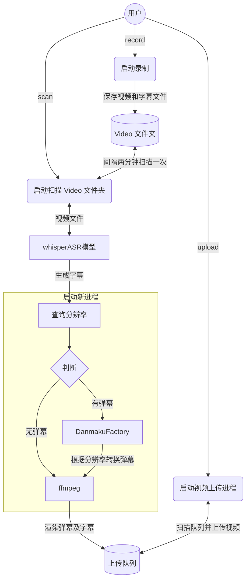

<div align="center">
  <picture>
    <source media="(prefers-color-scheme: dark)" srcset="assets/headerDark.svg" />
    
  </picture>

*7 x 24 小时无人监守录制、渲染弹幕、识别字幕、自动上传，启动项目，人人都是录播员。*

[:page_facing_up: Documentation](https://timerring.github.io/bilive/) |
[:gear: Installation](#quick-start) |
[:thinking: Reporting Issues](https://github.com/timerring/bilive/issues/new/choose)

</div>

##  1. Introduction

> 如果您觉得项目不错，欢迎 :star: 也欢迎 PR 合作，如果有任何疑问，欢迎提 issue 交流。

自动监听并录制B站直播和弹幕、自动转换xml弹幕（含付费留言、礼物等）为ass并渲染进视频，自动投稿**弹幕版视频**和**无弹幕视频**至B站，无需GPU，兼容超低配置服务器与主机，**兼容Windows 和 linux操作系统**。


## 2. Major features

- **速度快**：采用 `pipeline` 流水线处理视频，理想情况下录播与直播相差半小时以内，没下播就能上线录播，**目前已知 b 站录播最快版本**！
- **多房间**：同时录制多个直播间内容视频以及弹幕文件（包含普通弹幕，付费弹幕以及礼物上舰等信息）。
- **占用小**：自动删除本地已上传的视频，极致节省空间。
- **模版化**：无需复杂配置，开箱即用，( :tada: NEW)通过 b 站搜索建议接口自动抓取相关热门标签。
- **检测片段并合并**：对于网络问题或者直播连线导致的视频流分段，能够自动检测合并成为完整视频。
- **自动渲染弹幕**：自动转换xml为ass弹幕文件并且渲染到视频中形成**有弹幕版视频**并自动上传。
- **硬件要求极低**：无需GPU，只需最基础的单核CPU搭配最低的运存即可完成录制，弹幕渲染，上传等等全部过程，无最低配置要求，10年前的电脑或服务器依然可以使用！
- **( :tada: NEW)自动渲染字幕**(如需使用本功能，则需保证有 Nvidia 显卡)：采用 OpenAI 的开源模型 [`whisper`](https://github.com/openai/whisper)，自动识别视频内语音并转换为字幕渲染至视频中。

项目架构流程如下：




## 3. 测试硬件
+ OS: Ubuntu 22.04.4 LTS

  >尽量使用 22.04+ 的版本，更早版本的 ubuntu 自带 gcc 版本无法更新至 DanmakuFactory 以及 biliup-rs 所需版本，若使用较早版本，请参考 [version `GLIBC_2.34‘ not found简单有效解决方法](https://blog.csdn.net/huazhang_001/article/details/128828999)。
+ CPU：2核 Intel(R) Xeon(R) Platinum 85
+ GPU：无
+ 内存：2G
+ 硬盘：40G
+ 带宽: 3Mbps
  > 个人经验：若想尽可能快地更新视频，主要取决于上传速度而非弹幕渲染速度，因此建议网络带宽越大越好。

## 4. Quick start

更详细的教程请参考文档 [bilive](https://timerring.github.io/bilive/)

> [!NOTE]
> 如果你是 windows 用户，请不要使用命令提示符（Command Prompt）或 Windows PowerShell，请使用 [PowerShell](https://learn.microsoft.com/en-us/powershell/scripting/install/installing-powershell-on-windows?view=powershell-7.4) 或 Linux 终端例如 WSL 或 **Git Bash**(推荐)。

### Mode
首先介绍本项目三种不同的处理模式：
1. `pipeline` 模式(默认): 目前最快的模式，需要 GPU 支持，最好在 `blrec` 设置片段为半小时以内，asr 识别和渲染并行执行，分 p 上传视频片段。

2. `append` 模式: 基本同上，但 asr 识别与渲染过程串行执行，比 pipeline 慢预计 25% 左右，对 GPU 显存要求较低，兼顾硬件性能与处理上传效率。

3. `merge` 模式: 等待所有录制完成，再进行识别渲染合并过程，上传均为完整版录播（非分 P 投稿），等待时间较长，效率较慢，适合需要上传完整录播的场景。


> [!IMPORTANT]
> 凡是用到 GPU 均需保证 GPU 显存大于运行程序所需 VRAM，具体计算 VRAM 方法可以参考[该部分](https://timerring.github.io/bilive/models.html#计算-vram-需求)。

### Installation(有 GPU 版本)

> 是否有 GPU 以 `nvidia-smi` 显示 nvidia GPU 驱动以及 `nvcc -V` 显示 `CUDA` 版本号为准。如果未配置显卡驱动或未安装 `CUDA`，即使有 GPU 也无法使用，而会使用 CPU 推理（不推荐，可根据自身硬件条件判断是否尝试 CPU 推理）。

> [!TIP]
> 如果你是 windows 用户，请不要使用命令提示符（Command Prompt）或 Windows PowerShell，请使用 [PowerShell](https://learn.microsoft.com/en-us/powershell/scripting/install/installing-powershell-on-windows?view=powershell-7.4) 或 WSL 或 **Git Bash**(推荐)。
> 
> **注意：PowerShell 和 Windows PowerShell 是[不同的应用程序](https://learn.microsoft.com/en-us/powershell/scripting/whats-new/differences-from-windows-powershell?view=powershell-7.4&viewFallbackFrom=powershell-7.3)。**

#### 1. 安装依赖(推荐先 `conda` 创建虚拟环境)

```
cd bilive
pip install -r requirements.txt
```

此外请根据各自的系统类型安装对应的 [`ffmpeg`](https://www.ffmpeg.org/download.html)，例如 [ubuntu 安装 ffmpeg](https://gcore.com/learning/how-to-install-ffmpeg-on-ubuntu/)。

[常见问题收集](https://timerring.github.io/bilive/install-questions.html)

#### 2. 设置环境变量用于保存项目根目录

```
./setPath.sh && source ~/.bashrc
```

#### 3. 配置 whisper 模型

项目默认采用 [`small`](https://openaipublic.azureedge.net/main/whisper/models/9ecf779972d90ba49c06d968637d720dd632c55bbf19d441fb42bf17a411e794/small.pt) 模型，请点击下载所需文件，并放置在 `src/subtitle/models` 文件夹中。

> [!TIP]
> 使用该参数模型至少需要保证有显存大于 2.7GB 的 GPU，否则请使用其他参数量的模型。
> + 更多模型请参考 [whisper 参数模型](https://timerring.github.io/bilive/models.html) 部分。
> + 更换模型方法请参考 [更换模型方法](https://timerring.github.io/bilive/models.html#更换模型方法) 部分。


#### 4. biliup-rs 登录

首先按照 [biliup-rs](https://github.com/biliup/biliup-rs) 登录b站，登录脚本在 `src/upload/biliup` ，登录产生的`cookies.json`保留在该文件夹下即可。

[常见问题收集](https://timerring.github.io/bilive/biliup.html)

#### 5. 启动自动录制

```bash
./record.sh
```

[常见问题收集](https://timerring.github.io/bilive/record.html)

#### 6. 启动自动上传

请先确保你已经完成`步骤 3`，正确下载并放置了模型文件。

##### 6.1 启动扫描渲染进程

输入以下指令即可检测已录制的视频并且自动合并分段，自动进行弹幕转换，字幕识别与渲染的过程：

```bash
./scan.sh
```

[常见问题收集](https://timerring.github.io/bilive/scan.html)

##### 6.2 启动自动上传进程

```bash
./upload.sh
```

[常见问题收集](https://timerring.github.io/bilive/upload.html)


#### 7. 查看执行日志

相应的执行日志请在 `logs` 文件夹中查看，如果有问题欢迎在 [`issue`](https://github.com/timerring/bilive/issues/new/choose) 中提出。
```
logs # 日志文件夹
├── blrecLog # blrec 录制日志
│   └── ...
├── burningLog # 弹幕渲染日志
│   └── ...
├── mergeLog # 片段合并日志
│   └── ...
├── scanLog # scan运行日志
│   └── ...
├── uploadLog # 视频上传日志
│   └── ...
└── blrec.log # record.sh 运行日志
```

### Installation(无 GPU 版本)
无 GPU 版本过程基本同上，可以跳过步骤 3，需要注意在执行步骤 5 **之前**完成以下设置将确保完全用 CPU 渲染视频弹幕。

1. 请将 `src/config.py` 文件中的 `GPU_EXIST` 参数设置为 `False`。（若不置为 `False` 且则会使用 CPU 推理，不推荐，可自行根据硬件条件进行尝试。）
2. 将 `MODEL_TYPE` 调整为 `merge` 或者 `append`。

> [!TIP]
> 上传默认参数如下，[]中内容全部自动替换。也可在 src/upload/extract_video_info.py 中自定义相关配置：
> + 默认标题是"【弹幕+字幕】[XXX]直播回放-[日期]-[直播间标题]"。
> + 默认描述是"【弹幕+字幕】[XXX]直播，直播间地址：[https://live.bilibili.com/XXX] 内容仅供娱乐，直播中主播的言论、观点和行为均由主播本人负责，不代表录播员的观点或立场。"
> + 默认标签是根据主播名字自动在 b 站搜索推荐中抓取的[热搜词]，详见[bilibili-API-collect](https://github.com/SocialSisterYi/bilibili-API-collect/blob/master/docs/search/suggest.md)。


## 特别感谢

- [biliup/biliup-rs](https://github.com/biliup/biliup-rs)
- [hihkm/DanmakuFactory](https://github.com/hihkm/DanmakuFactory)
- [acgnhiki/blrec](https://github.com/acgnhiki/blrec)
- [OpenAI/whisper](https://github.com/OpenAI/whisper)