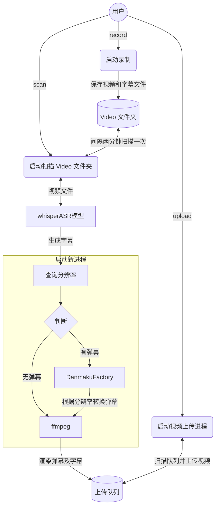

<div align="center">
  <picture>
    <source media="(prefers-color-scheme: dark)" srcset="assets/headerDark.svg" />
    
  </picture>

*7 x 24 小时无人监守录制、渲染弹幕、识别字幕、自动上传，启动项目，人人都是录播员。*

[:page_facing_up: Documentation](#major-features) |
[:gear: Installation](#quick-start) |
[:thinking: Reporting Issues](https://github.com/timerring/bilive/issues/new/choose)

</div>

##  1. Introduction

> 如果您觉得项目不错，欢迎 :star: 也欢迎 PR 合作，如果有任何疑问，欢迎提 issue 交流。

自动监听并录制B站直播和弹幕、自动转换xml弹幕（含付费留言、礼物等）为ass并渲染进视频，自动投稿**弹幕版视频**和**无弹幕视频**至B站，无需GPU，兼容超低配置服务器与主机，**兼容Windows 和 linux操作系统**。


## 2. Major features

<!-- - **速度快**：~~录制的同时可以选择启动无弹幕版视频的上传进程，下播即上线平台~~。(无弹幕版暂缓上线，等维护完成下一个版本上线) -->
- **速度快**：采用 `pipeline` 流水线处理视频，理想情况下录播与直播相差半小时以内，没下播就能上线录播！
- **多房间**：同时录制多个直播间内容视频以及弹幕文件（包含普通弹幕，付费弹幕以及礼物上舰等信息）。
- **占用小**：自动删除本地已上传的视频，极致节省空间。
- **模版化**：无需复杂配置，开箱即用，( :tada: NEW)通过 b 站搜索建议接口自动抓取相关热门标签。
- **检测片段并合并**：对于网络问题或者直播连线导致的视频流分段，能够自动检测合并成为完整视频。
- **渲染弹幕版视频**：自动转换xml为ass弹幕文件并且渲染到视频中形成**有弹幕版视频**并自动上传。
- **硬件要求极低**：无需GPU，只需最基础的单核CPU搭配最低的运存即可完成录制，弹幕渲染，上传等等全部过程，无最低配置要求，10年前的电脑或服务器依然可以使用！
- **( :tada: NEW)自动渲染字幕**(如需使用本功能，则需保证有 Nvidia 显卡)：采用 OpenAI 的开源模型 [`whisper`](https://github.com/openai/whisper)，自动识别视频内语音并转换为字幕渲染至视频中。

项目架构流程如下：




## 3. 测试硬件
+ OS: Ubuntu 22.04.4 LTS

  >尽量使用 22.04+ 的版本，更早版本的 ubuntu 自带 gcc 版本无法更新至 DanmakuFactory 以及 biliup-rs 所需版本，若使用较早版本，请参考 [version `GLIBC_2.34‘ not found简单有效解决方法](https://blog.csdn.net/huazhang_001/article/details/128828999)。
+ CPU：2核 Intel(R) Xeon(R) Platinum 85
+ GPU：无
+ 内存：2G
+ 硬盘：40G
+ 带宽: 3Mbps
  > 个人经验：若想尽可能快地更新视频，主要取决于上传速度而非弹幕渲染速度，因此建议网络带宽越大越好。

> [!TIP]
> 关于渲染速率：与弹幕数量有关，测试硬件的基本区间 2核 Xeon(R) Platinum 85 的 CPU 的渲染速率在 3 ~ 6 倍之间，也可使用 Nvidia GPU 加速，项目的测试显卡为 GTX1650，其渲染速率在 16 ～ 20 倍之间。 
> 
> 弹幕渲染具体时间可通过 `渲染速率x视频时长` 估算，如无需 GPU 加速渲染过程，请忽略本条提示。
> 
> 如需使用 Nvidia GPU 加速，
> 请参考：
> + [Using FFmpeg with NVIDIA GPU Hardware Acceleration](https://docs.nvidia.com/video-technologies/video-codec-sdk/12.0/ffmpeg-with-nvidia-gpu/index.html)
> + [使用GPU为FFmpeg 加速](https://yukihane.work/li-gong/ffmpeg-with-gpu)

## 4. Quick start

> [!NOTE]
> 如果你是 windows 用户，请不要使用命令提示符（Command Prompt）或 Windows PowerShell，请使用 [PowerShell](https://learn.microsoft.com/en-us/powershell/scripting/install/installing-powershell-on-windows?view=powershell-7.4) 或 Linux 终端例如 WSL 或 **Git Bash**(推荐)。
> 
> **注意：PowerShell 和 Windows PowerShell 是[不同的应用程序](https://learn.microsoft.com/en-us/powershell/scripting/whats-new/differences-from-windows-powershell?view=powershell-7.4&viewFallbackFrom=powershell-7.3)。**
 
### 4.1 安装环境
```
# 进入项目目录
cd bilive
# 安装所需依赖 推荐先 conda 创建虚拟环境
pip install -r requirements.txt
# 记录项目根目录
./setPath.sh && source ~/.bashrc
```

项目大多数参数均在 `src/allconfig.py` 文件中，相关参数如下:
+ GPU_EXIST 是否存在 GPU(以 `nvidia-smi` 显示驱动以及 `CUDA` 检查通过为主)
+ MODEL_TYPE 渲染模式，
  +  `pipeline` 模式(默认): 目前最快的模式，需要 GPU 支持，最好在 `blrec` 设置片段为半小时以内，asr 识别和渲染并行执行，分 p 上传视频片段。
  + `append` 模式: 基本同上，但 asr 识别与渲染过程串行执行，比 pipeline 慢预计 25%。
  + `merge` 模式: 等待所有录制完成，再进行合并识别渲染过程，上传均为完整版录播。

以下功能默认开启，如果无 GPU，请直接看 4.2 节，并将 `src/allconfig.py` 文件中的 `GPU_EXIST` 参数设置为 `False`，并将 `MODEL_TYPE` 调整为 `merge` 或者 `append`。
如果需要使用自动识别并渲染字幕功能，模型参数及链接如下，注意 GPU 显存必须大于所需 VRAM：

|  Size  | Parameters | Multilingual model | Required VRAM |
|:------:|:----------:|:------------------:|:-------------:|
|  tiny  |    39 M    |       [`tiny`](https://openaipublic.azureedge.net/main/whisper/models/65147644a518d12f04e32d6f3b26facc3f8dd46e5390956a9424a650c0ce22b9/tiny.pt)       |     ~1 GB     |
|  base  |    74 M    |       [`base`](https://openaipublic.azureedge.net/main/whisper/models/ed3a0b6b1c0edf879ad9b11b1af5a0e6ab5db9205f891f668f8b0e6c6326e34e/base.pt)       |     ~1 GB     |
| small  |   244 M    |      [`small`](https://openaipublic.azureedge.net/main/whisper/models/9ecf779972d90ba49c06d968637d720dd632c55bbf19d441fb42bf17a411e794/small.pt)       |     ~2 GB     |
| medium |   769 M    |      [`medium`](https://openaipublic.azureedge.net/main/whisper/models/345ae4da62f9b3d59415adc60127b97c714f32e89e936602e85993674d08dcb1/medium.pt)      |     ~5 GB     |
| large  |   1550 M   |      [`large`](https://openaipublic.azureedge.net/main/whisper/models/81f7c96c852ee8fc832187b0132e569d6c3065a3252ed18e56effd0b6a73e524/large-v2.pt)       |    ~10 GB     |

> [!NOTE]
> 1. 项目默认采用 [`small`](https://openaipublic.azureedge.net/main/whisper/models/9ecf779972d90ba49c06d968637d720dd632c55bbf19d441fb42bf17a411e794/small.pt) 模型，请自行下载所需文件，并放置在 `src/subtitle/models` 文件夹中。
> 2. 由于 github 单个文件上限是 100MB，因此本仓库内只保留了 tiny 模型以供试用，如需试用请将 `settings.ini` 文件中的 `Mode` 参数设置为模型对应Size名称`tiny`，使用其他参数量模型同理。
> 3. 如果追求识别准确率，推荐使用参数量 `small` 及以上的模型。

### 4.2 biliup-rs 登录

首先按照 [biliup-rs](https://github.com/biliup/biliup-rs) 登录b站，登录脚本在 `src/upload/biliup` ，登录产生的`cookies.json`保留在该文件夹下即可。

### 4.3 启动自动录制

- 在 `record.sh`启动脚本中设置端口 `port`
- 在 `settings.toml` 中设置视频存放目录、日志目录，也可启动后在 blrec 前端界面即`http://localhost:port` 中进行设置。详见 [blrec](https://github.com/acgnhiki/blrec)。

启动 blrec：

```bash
./record.sh
```
### 4.4 启动自动上传

> 请先确保你已经完成了 4.1 步骤，下载并放置了模型文件。
> 否则，请将 `src/allconfig.py` 文件中的 `GPU_EXIST` 参数设置为 `False`

#### 启动扫描渲染进程

输入以下指令即可检测已录制的视频并且自动合并分段，自动进行弹幕转换，字幕识别与渲染的过程：

```bash
./scan.sh
```

#### 启动自动上传进程

```bash
./upload.sh
```

> [!TIP]
> 上传默认参数如下，[]中内容全部自动替换。也可在 src/upload/extract_video_info.py 中自定义相关配置：
> + 默认标题是"【弹幕】[XXX]直播回放-[日期]-[直播间标题]"。
> + 默认描述是"【弹幕+字幕】[XXX]直播，直播间地址：[https://live.bilibili.com/XXX] 内容仅供娱乐，直播中主播的言论、观点和行为均由主播本人负责，不代表录播员的观点或立场。"
> + 默认标签是根据主播名字自动在 b 站搜索推荐中抓取的[热搜词]，详见[bilibili-API-collect](https://github.com/SocialSisterYi/bilibili-API-collect/blob/master/docs/search/suggest.md)。

> [!NOTE]
> 相应的执行日志请在 `logs` 文件夹中查看。
> ```
> logs # 日志文件夹
> ├── blrecLog # blrec 录制日志
> │   └── ...
> ├── burningLog # 弹幕渲染日志
> │   └── ...
> ├── mergeLog # 片段合并日志
> │   └── ...
> ├── scanLog # scan运行日志
> │   └── ...
> ├── uploadLog # 视频上传日志
> │   └── ...
> └── blrec.log # record.sh 运行日志
> ```

## 特别感谢

- [biliup/biliup-rs](https://github.com/biliup/biliup-rs)
- [FortuneDayssss/BilibiliUploader](https://github.com/FortuneDayssss/BilibiliUploader)
- [hihkm/DanmakuFactory](https://github.com/hihkm/DanmakuFactory)
- [acgnhiki/blrec](https://github.com/acgnhiki/blrec)
- [qqyuanxinqq/AutoUpload_Blrec](https://github.com/qqyuanxinqq/AutoUpload_Blrec)
- [OpenAI/whisper](https://github.com/OpenAI/whisper)
